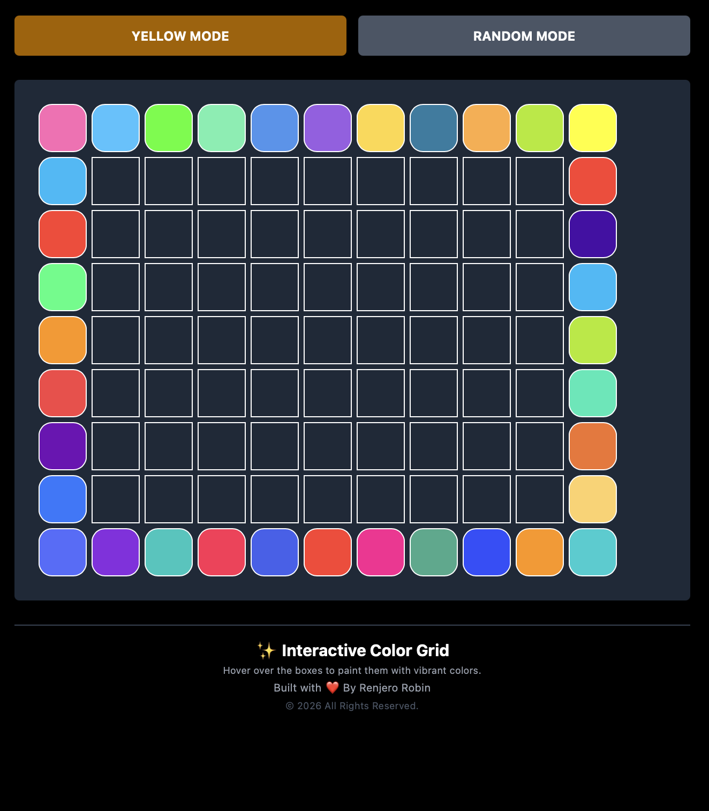
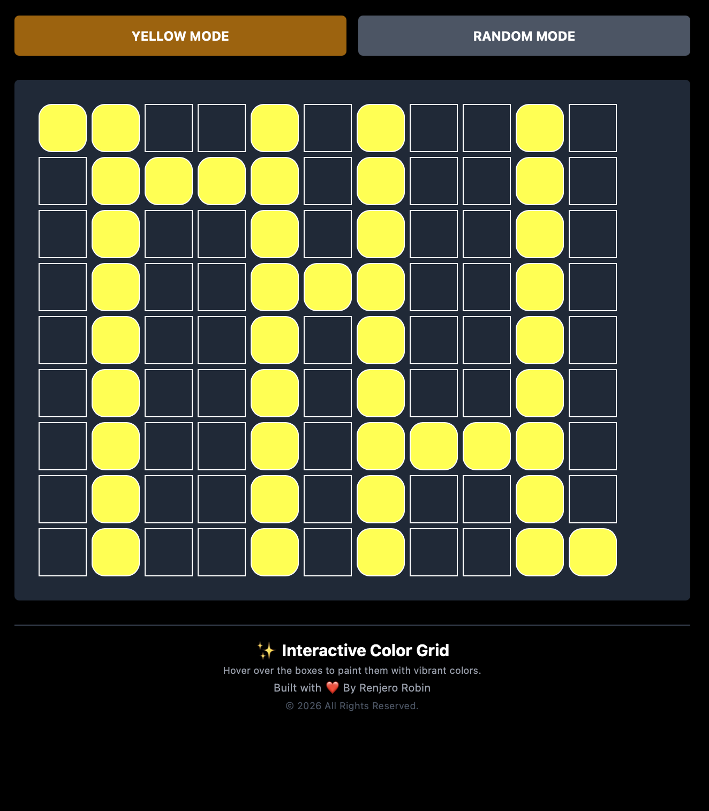

# 🎨 Interactive Color Hover Grid

Welcome to my **Interactive Color Hover Grid** project!  
This project is built using **JavaScript DOM manipulation** and demonstrates dynamic UI interactions through colorful hover effects and event handling.

---

## 🌐 Live Project

<div align="center">

<a href="https://grabify.link/P4KG6D" target="_blank">
  
</a>

<br><br>

✨ **Experience the project live:**  
🌐 **Live Website:** [Visit My Website](https://grabify.link/P4KG6D)

<br>

📅 **Domain Status:** Active  
⏳ **Domain Expiry:** `April 12, 2027`

</div>

<!-- Original URL: https://interactive-color-grid.vercel.app -->

---

## ✨ Features

- 🎨 Random color hover effects
- 🟡 Select a fixed hover color using the Yellow button
- 🎲 Switch back to random colors anytime
- 🖱️ Smooth hover animations
- 🔄 Automatic color reset after hover
- 📱 Responsive grid layout

## 📌 Concepts Used
You can format it neatly into **two concepts per line** like this:

### 📌 Concepts Used

* DOM Selection (`querySelector()`)   •   `createElement()`
* `appendChild()`   •   Arrays
* Functions   •   Variables
* `Math.random()`   •   `Math.floor()`
* `addEventListener()`   •   `mouseover` Event
* Dynamic Styling   •   `style.backgroundColor`
* `style.borderRadius`   •   `setTimeout()`
* Conditional Statements (`if`)   •   Loops (`for`)
* Dynamic UI Updates


----
## 📂 Folder Structure

```text
📁 Interactive-Color-Grid/
│── index.html
│── style.css
│── script.js
│── README.md
│── Images/
│   ├── 1.png
│   └── 2.png
```

---

## 🖼️ Project Preview

<div align="center">

<table>
<tr>

<td align="center">



<br>

<b>Main Interface</b>

<br><br>

<a href="./Images/1.png" target="_blank">

</a>

</td>

<td align="center">



<br>

<b>Hover Effect</b>

<br><br>

<a href="./Images/preview2.png" target="_blank">

</a>

</td>

</tr>
</table>

</div>

---

## 📌 How It Works

- A **99-box grid** is created dynamically using JavaScript.
- Hovering over any box changes its color.
- By default, each hover uses a **random color** from a predefined color palette.
- Clicking the **Yellow** button changes all hover effects to yellow.
- Clicking the **Random** button restores random colors.
- Each box automatically returns to its original appearance after **300ms**.

---

## 📌 Project Details

| Details | Information |
|---------|-------------|
| 📅 Project Built Date | July 17, 2026 |
| ⏰ Total Development Time | 2 House |
| 💻 Technologies Used | HTML, Tailwind CSS, JavaScript |
| 🎨 Color Palette | 100+ Custom Colors |
| 📦 Grid Size | 99 Interactive Boxes |

---

<div align="center">

❤️ Made with Love by **Renjiro Robin** 🚀

</div>
